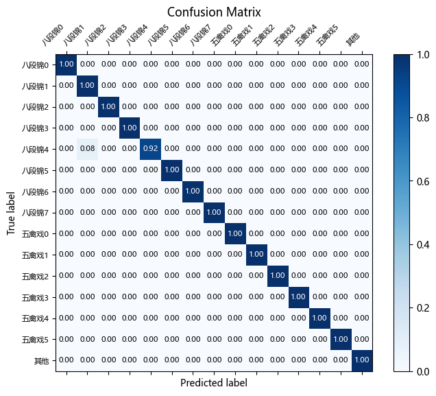
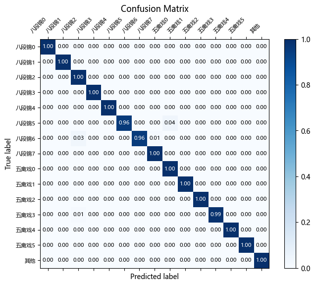
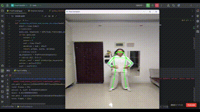

# 基于人体姿态关键点的视频分类和打分模型

该项目整合了 **RTMPose 姿态识别**和 **ST-GCN 时空图卷积**两个模型，结合开创性的**距离角度判定算法**成功实现了“基于人体姿态关键点的视频分类和打分任务”。

# 模型介绍

[RTMPose介绍.pdf](doc/RTMPose介绍.pdf)

[ST-GCN介绍.pdf](doc/ST-GCN模型介绍.pdf)

[基于距离角度比对的动作打分算法.pdf](基于距离角度比对的动作打分算法.pdf)


# 任务说明和实现效果演示

以中国传统文化中的“八段锦”“五禽戏”共计 14 个动作为分类目标，使用“中国移动动感地带AI+高校创智计划”提供的数据集，在 14 个类别上实现高效推理和评分。

## 输出结果展示
在验证集上的输出如下表展示。可以看到，模型成功完成了对动作的分类和打分。

<div style="overflow-y: auto; height: 300px;">
  <table border="1">
    <tr><th>视频名称</th><th>动作分类</th><th>标注度评分</th><th>推理耗时</th></tr>
    <tr><td>reference_10.mp4</td><td>10</td><td>0.52</td><td>7.03</td></tr>
    <tr><td>reference_157.mp4</td><td>14(NG)</td><td>0.00</td><td>13.33</td></tr>
    <tr><td>reference_158.mp4</td><td>14(NG)</td><td>0.00</td><td>13.10</td></tr>
    <tr><td>reference_159.mp4</td><td>14(NG)</td><td>0.00</td><td>13.07</td></tr>
    <tr><td>reference_160.mp4</td><td>14(NG)</td><td>0.00</td><td>12.96</td></tr>
    <tr><td>reference_161.mp4</td><td>14(NG)</td><td>0.00</td><td>13.08</td></tr>
    <tr><td>reference_8.mp4</td><td>8</td><td>0.61</td><td>8.66</td></tr>
    <tr><td>standard_10.mp4</td><td>10</td><td>1.00</td><td>6.48</td></tr>
    <tr><td>standard_8.mp4</td><td>8</td><td>1.00</td><td>8.32</td></tr>
    <tr><td>动作0-4-29.mp4</td><td>0</td><td>0.86</td><td>6.46</td></tr>
    <tr><td>动作0-4-43.mp4</td><td>0</td><td>0.76</td><td>6.53</td></tr>
    <tr><td>动作0-4-44.mp4</td><td>0</td><td>0.64</td><td>6.50</td></tr>
    <tr><td>动作0-5-1.mp4</td><td>0</td><td>0.78</td><td>6.91</td></tr>
    <tr><td>动作1-4-3.mp4</td><td>1</td><td>0.45</td><td>6.37</td></tr>
    <tr><td>动作1-4-30.mp4</td><td>1</td><td>0.57</td><td>5.85</td></tr>
    <tr><td>动作1-4-4.mp4</td><td>1</td><td>0.60</td><td>6.32</td></tr>
    <tr><td>动作1-4-45.mp4</td><td>1</td><td>0.47</td><td>6.03</td></tr>
    <tr><td>动作10-1-13.mp4</td><td>10</td><td>0.52</td><td>6.57</td></tr>
    <tr><td>动作10-1-2.mp4</td><td>10</td><td>0.54</td><td>6.45</td></tr>
    <tr><td>动作10-1-8.mp4</td><td>10</td><td>0.51</td><td>6.39</td></tr>
    <tr><td>动作10-3-3.mp4</td><td>10</td><td>0.56</td><td>6.29</td></tr>
    <tr><td>动作11-10-14.mp4</td><td>11</td><td>0.49</td><td>5.99</td></tr>
    <tr><td>动作11-10-28.mp4</td><td>8</td><td>0.50</td><td>6.30</td></tr>
    <tr><td>动作11-10-42.mp4</td><td>11</td><td>0.50</td><td>6.10</td></tr>
    <tr><td>动作11-10-55.mp4</td><td>11</td><td>0.47</td><td>5.80</td></tr>
    <tr><td>动作12-12-45.mp4</td><td>12</td><td>0.82</td><td>5.56</td></tr>
    <tr><td>动作12-12-66.mp4</td><td>12</td><td>0.79</td><td>5.89</td></tr>
    <tr><td>动作12-12-67.mp4</td><td>12</td><td>0.75</td><td>6.16</td></tr>
    <tr><td>动作12-13-26.mp4</td><td>12</td><td>0.83</td><td>5.74</td></tr>
    <tr><td>动作13-10-16.mp4</td><td>13</td><td>0.54</td><td>6.24</td></tr>
    <tr><td>动作13-10-30.mp4</td><td>13</td><td>0.61</td><td>5.37</td></tr>
    <tr><td>动作13-10-44.mp4</td><td>13</td><td>0.60</td><td>5.52</td></tr>
    <tr><td>动作13-10-57.mp4</td><td>13</td><td>0.68</td><td>5.27</td></tr>
    <tr><td>动作13-9-70.mp4</td><td>13</td><td>0.64</td><td>5.19</td></tr>
    <tr><td>动作2-4-31.mp4</td><td>2</td><td>0.68</td><td>5.23</td></tr>
    <tr><td>动作2-4-47.mp4</td><td>2</td><td>0.74</td><td>5.06</td></tr>
    <tr><td>动作2-4-5.mp4</td><td>2</td><td>0.62</td><td>5.19</td></tr>
    <tr><td>动作2-4-6.mp4</td><td>2</td><td>0.64</td><td>5.13</td></tr>
    <tr><td>动作3-11-37.mp4</td><td>3</td><td>0.80</td><td>5.77</td></tr>
    <tr><td>动作3-11-38.mp4</td><td>3</td><td>0.79</td><td>6.30</td></tr>
    <tr><td>动作3-12-10.mp4</td><td>3</td><td>0.82</td><td>6.28</td></tr>
    <tr><td>动作3-12-11.mp4</td><td>3</td><td>0.81</td><td>5.92</td></tr>
    <tr><td>动作4-11-40.mp4</td><td>4</td><td>0.38</td><td>8.07</td></tr>
    <tr><td>动作4-11-41.mp4</td><td>4</td><td>0.40</td><td>7.89</td></tr>
    <tr><td>动作4-12-13.mp4</td><td>4</td><td>0.39</td><td>8.73</td></tr>
    <tr><td>动作4-12-14.mp4</td><td>4</td><td>0.41</td><td>7.62</td></tr>
    <tr><td>动作4-12-15.mp4</td><td>4</td><td>0.23</td><td>8.24</td></tr>
    <tr><td>动作5-5-48.mp4</td><td>5</td><td>0.54</td><td>8.25</td></tr>
    <tr><td>动作5-5-60.mp4</td><td>5</td><td>0.60</td><td>8.38</td></tr>
    <tr><td>动作5-5-79.mp4</td><td>5</td><td>0.71</td><td>8.87</td></tr>
    <tr><td>动作5-5-80.mp4</td><td>5</td><td>0.39</td><td>9.78</td></tr>
    <tr><td>动作6-4-13.mp4</td><td>6</td><td>0.32</td><td>5.08</td></tr>
    <tr><td>动作6-4-14.mp4</td><td>6</td><td>0.28</td><td>4.47</td></tr>
    <tr><td>动作6-4-35.mp4</td><td>6</td><td>0.34</td><td>4.58</td></tr>
    <tr><td>动作6-4-55.mp4</td><td>6</td><td>0.42</td><td>5.01</td></tr>
    <tr><td>动作6-4-56.mp4</td><td>6</td><td>0.41</td><td>4.58</td></tr>
    <tr><td>动作6-5-21.mp4</td><td>6</td><td>0.38</td><td>4.60</td></tr>
    <tr><td>动作6-5-35.mp4</td><td>7</td><td>0.32</td><td>4.60</td></tr>
    <tr><td>动作6-5-49.mp4</td><td>6</td><td>0.36</td><td>4.72</td></tr>
    <tr><td>动作6-5-61.mp4</td><td>6</td><td>0.43</td><td>4.64</td></tr>
    <tr><td>动作6-5-7.mp4</td><td>6</td><td>0.38</td><td>4.76</td></tr>
    <tr><td>动作6-5-81.mp4</td><td>6</td><td>0.45</td><td>4.63</td></tr>
    <tr><td>动作7-11-48.mp4</td><td>7</td><td>0.99</td><td>6.79</td></tr>
    <tr><td>动作7-11-49.mp4</td><td>7</td><td>0.93</td><td>6.30</td></tr>
    <tr><td>动作7-11-50.mp4</td><td>7</td><td>0.96</td><td>6.50</td></tr>
    <tr><td>动作7-12-22.mp4</td><td>7</td><td>0.92</td><td>6.32</td></tr>
    <tr><td>动作8-1-23.mp4</td><td>8</td><td>0.57</td><td>8.98</td></tr>
    <tr><td>动作8-1-34.mp4</td><td>8</td><td>0.71</td><td>9.61</td></tr>
    <tr><td>动作8-1-4.mp4</td><td>8</td><td>0.75</td><td>8.74</td></tr>
    <tr><td>动作9-10-12.mp4</td><td>9</td><td>0.55</td><td>8.16</td></tr>
    <tr><td>动作9-10-26.mp4</td><td>9</td><td>0.46</td><td>7.83</td></tr>
    <tr><td>动作9-8-49.mp4</td><td>9</td><td>0.61</td><td>8.50</td></tr>
  </table>
</div>

## 分类任务混淆矩阵

在机器学习中，混淆矩阵是一个非常有用的工具，尤其是在分类问题的评估中。它提供了一个简明扼要的方式来了解模型在不同类别上的表现，尤其是每个类别的预测结果和实际结果之间的关系。

我们分别制作了训练集和验证集上的混淆矩阵图，来直观观察模型的分类效果。从图中可以看出，大多数类别的预测准确度非常高，主对角线上的值接近1.00。这表明模型对这些类别的分类性能非常好。




## RTMPose 在本项目中的演示

我们简要实现了对 RTMPose 模型输出的关键点 keypoints.npy 数据的可视化，用于直观检查关键点生成效果。可以看到，模型在整个视频时长内都完全准确识别出了人物，并高效、实时地生成了关键点数据。



## 在测试集上的评估效果

### 不同 ST-GCN 模型在测试集上的预测效果

- best_model.pth: 最初的模型，未添加数据增强模块，采用 Padding 的方法填充时间轴。直接在训练集上训练，采用早停和 K 折交叉验证，并选取一个 val accuracy 最高的模型。
- best_model_2.pth: 利用三次样条插值算法填充时间轴，解决了模型对时间的过拟合现象；添加旋转、平移和缩放数据增强模块。
- best_model_3.pth: 数据增强中添加随机采样，减少模型对特定模式的过拟合，增强泛化性能。
- best_model_4.pth: 优化随机采样算法，更加均匀；添加镜面数据增强模块，解决无法识别镜面动作的问题。

# 任务流程

## Step1. 数据集构建

### 模型训练数据

#### 训练集和验证集

- **获取 mp4 RAW data**: 使用“中国移动动感地带AI+高校创智计划”提供的数据集用作模型训练，共 15 类视频（八段锦 * 8， 五禽戏 * 6， 其它 * 1），每类视频各 50 个;
- **将视频文件转化为姿态关键点 keypoints**：利用 `RTMlib` 实现 `RTMPoseTran` 类，将单个视频文件转化为关键点数据；
- **姿态关键点预处理**：利用插值算法对姿态关键点数据预处理，with `PreProcess()` 方法，将关键点数据转变为模型可以处理的张量形状；
- **随机分配到训练集和验证集**：按 9 ：1 比例，分配数据到训练集和验证集。

#### K 折交叉验证

K 折交叉验证（K-Fold Cross Validation）是一种模型评估方法，将数据集分为 K 份（folds），每次用其中 K-1 份作为训练集，剩下的一份作为验证集，循环 K 次，最终取所有验证结果的平均值作为模型性能的评估。  

**作用**：
- **减少数据分割偏差**：通过多次训练和验证，避免单次划分导致的偶然性。
- **充分利用数据**：每个数据点都被用作训练和验证，避免浪费数据。
- **提供稳健的性能评估**：更可靠地反映模型在未见数据上的泛化能力。

#### 数据增强

采用多种数据增强方式，包括**旋转、平移、缩放、镜像、随机采样**，最终将数据量扩充至原先的 5 倍。

### 模型测试数据

为了验证模型的泛化效果，需要获取在训练集和验证集上从未出现过的视频数据。通过发动身边的同学和家长录制视频，以及网络资料汇总，共同构建测试集。由于不同人对“八段锦”和“五禽戏”的理解大相径庭，以及视频拍摄角度各不相同，和验证集相比，我们构建的测试集的识别难度相当高，想要完全准确识别，是一个相当具有挑战性的任务。

测试集数据共 70 个视频，14 个动作每类动作各 5 个，不包含“其它”类。

## Step2. 建立 ST-GCN 网络模型类

实现 `model` 类，定义网络结构 `ST-GCN Block` `ST-GCN` 以及关节连接图 `Graph` 类。

## Step3. 训练 ST-GCN 模型

## Step4. 测试训练效果

将预训练模型转为 val mode，在测试集上进行测试。利用混淆矩阵，直观展现模型在训练集、验证集和测试集上的效果，并选择最优模型。

# 项目结构

- **`/config`**: "包含**距离角度判定算法**需要的依赖文件；
- **`/data`**: 包含模型训练用到的视频关键点 numpy 文件，由 datagen.py 生成，避免每次训练都要重新读取视频；
- **`/model`**: 存放预训练模型，或模型训练完毕后的默认保存位置；
- **`/res`**: 存放推理结果，通常为 .csv 文件；
- **`/src`**: 项目源代码；
- **`/tools`**: 项目用到的其他工具代码，包括数据结构转换、数据集自动构建、numpy 文件可视化等
- **`/vid`**: 默认的视频存放路径；
- **`/doc`**: 存放项目说明文档和相关依赖图片。

一级目录下的其他文件：

- **`PoseTracking.py`**: 基于预训练模型实现推理和打分任务；
- **`README.md`**: 本文件；
- **`main.py`**: 实现 ST-GCN 模型训练和推理功能，已逐步弃用并耦合进 /src；
- **`requirements.txt`**: 依赖文件列表，不包含 pytorch
- **`setup.py`**: 自动化部署脚本，待实现

## src 文件简介

- `data_feeder.py`: 创建 dataset 的依赖类；
- `datapro.py`: 数据增强模块，包含多种数据增强算法；
- `early_stopping.py`: 早停类，实现训练过程的早停；
- `infer.py`: 推理方法，实现批量推理；
- `model.py`: ST-GCN 模型实现；
- `rtmpose_tran.py`: 调用 RTMPose 实现视频转关键点；
- `score.py`: DAA 打分模型算法实现；
- `test.py`: 测试模型并可视化；
- `train.py`: 训练模型，包含多个训练方法；
- `utils.py`: 工具方法的实现；
- `visualize.py`: 数据可视化例如混淆矩阵的实现

# 部署流程

## 在本地环境克隆或解压此项目

### 使用 git

如果你希望通过 Git 克隆项目，你需要首先确保你的系统已经安装了 Git。可以在终端或命令行中运行以下命令来克隆项目：

```bash
git clone https://github.com/ZHmQAQ/PoseClassifier.git
cd PoseClassifier
```

将 `[项目Git仓库URL]` 替换为你的实际项目 Git 仓库地址。

### 使用压缩包

略。

## 自行安装 PyTorch 相关依赖

根据你的系统和是否需要 GPU 支持，安装命令可能有所不同。你可以在 PyTorch 的官方网站（[PyTorch Get Started](https://pytorch.org/get-started/locally/)）上找到适合你系统的安装指令。

## 安装项目依赖

### 使用 requirements.txt

你可以使用以下命令安装所有必要的 Python 库：

```bash
pip install -r requirements.txt
```

### （可选）安装 ONNX Runtime 相关组件以使用 GPU

如果希望使用 GPU 进行推理，由于 RTMPose 采用 ONNX 模型，因此需要安装以下相关依赖组件：

#### NVidia CUDA Toolkit

1. 访问 [NVIDIA CUDA Toolkit 网站](https://developer.nvidia.com/cuda-downloads)。
2. 选择适合你的操作系统的版本（确保与你的 GPU 驱动兼容）。
3. 下载并安装 CUDA Toolkit。

#### NVidia cuDNN

1. 访问 [NVIDIA cuDNN 页面](https://developer.nvidia.com/cudnn)。
2. 需要注册并登录 NVIDIA 开发者账户以下载 cuDNN。
3. 根据你已安装的 CUDA 版本选择对应的 cuDNN 版本。
4. 下载并按照官方指南安装 cuDNN。

#### ONNX Runtime GPU

安装 ONNX Runtime 以支持 GPU，可以使用 `pip` 直接安装适配 GPU 的版本：

```bash
pip install onnxruntime-gpu
```

